## Porfolio Guide
This guide will be split into specific projects, in chronological order. Alternatively, each one can be accessed by clicking it's subsequent link below.

#### Links:
- [ME 2110 Competition Project](#2110)
- [CS 4641 Group Project](#4641)
- [ME 4182 Capstone](#4182)
- [Undergraduate Research](#undrgrd)

## ME 2110, Creative Decisions and Designs: Competition Project
In this class students learned different approaches to ideation and were exposed to the engineering process throughout the entire semester. The class revolved around creating a robot for the class competition at the end of the semester. In the compettion, each team competes in two rounds and those with strong scores in those rounds continue in the competition. After the qualifying rounds the competition runs similarly to a tournament with over 50 teams at the start, in qualifying, and 32 in the first elimination round. Each semester has a theme, ours was Infinity Wars. Our team "Schawarma Palace" came second in design review and our robot "Black Widow" came in 10th place in the competition, making the quarterfinals.

The goal of the competition was to score the most points, head-to-head, against three other teams. The main ways to score points in the competition were saving the "Hulk" object, pushing away the "Thanos" object, recovering "infinity stones", and grabbing the "infinty gauntlet".

  
  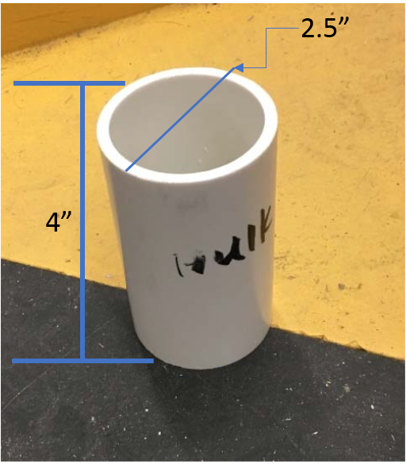
  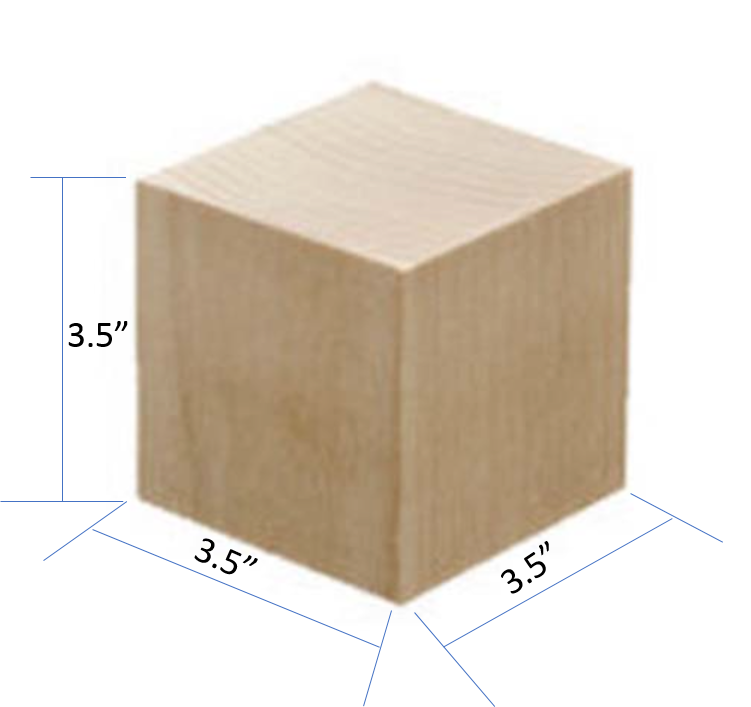
  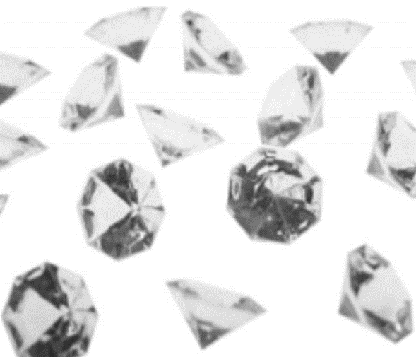
  

  <i>From left to right: Competition Track, Hulk, Thanos, Infinity Stones, Infinity Gauntlet</i>

Our robot's design differed compared to the majority of robot designs. While most teams situated their robot with one of the short end facing the center of the competition zone, we placed "Black Widow" with one of the long end facing the center, allowing us to use a cart to collect gems instead of a sliding arm.

  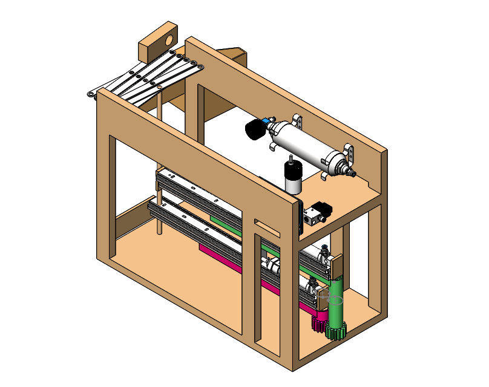
  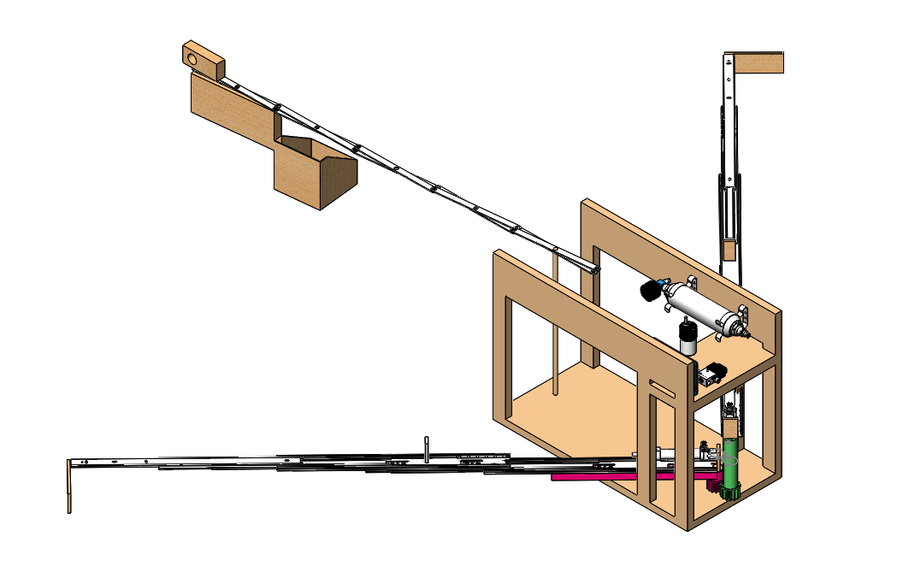

  <i>Majority of robot designs shared similarities with this preliminary design we created during our ideation process, uses a sliding arm and bucket to collect gems</i>

  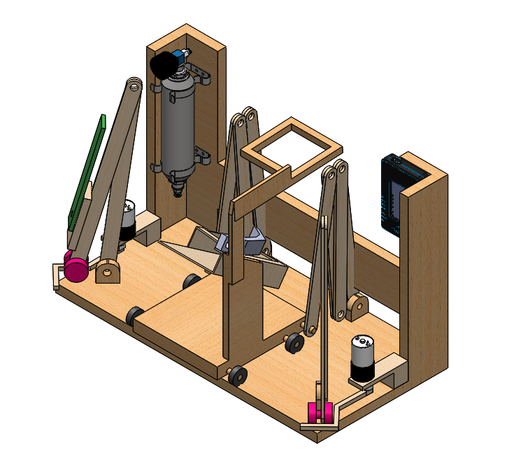
  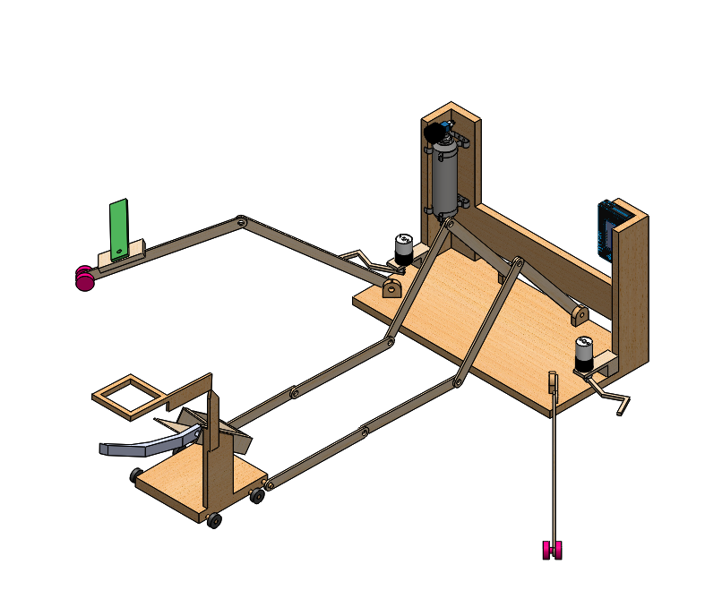

  <i>Final design of Black Widow, major differences are orientation of robot and rolling cart for gem collection</i>

During this project, I was tasked with creating our team logo and some of the CAD, machining and assembling the robot, writing the Labview coding loop for the NI MyRIO, and writing parts of our report.

  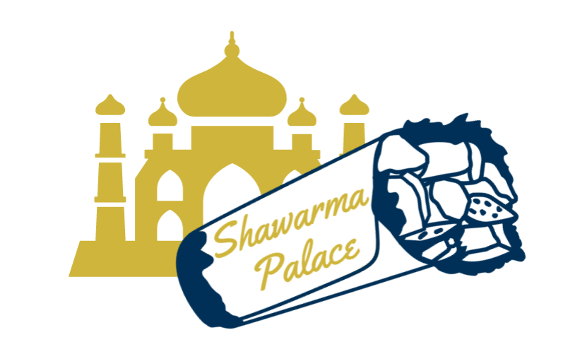

  <i>Logo created using CustomInk interface</i>

If you're interested in learning more about the competition and our design process here is our [final video](https://www.youtube.com/watch?v=8frTduJzepY).

## CS 4641, Intro to Machine Learning: Group Project

As the title of the class suggests, CS 4641 was an introductory course for upperclassmen to learn many unsupervised and supervised machine learning algorithms. At the start of the course students were split into groups and decided what topic to structure their projects' around. As I didn't know many students in my section, my team consisted of myself and three people I had never met previously. We chose the prediction of heart disease as our topic. The main premise of our project was to pull datasets from online and ran them through unsupervised learning algorithms to prune and improve the consistency of our data. Once the initial pruning was complete we utilized many supervised learning algorithms, such as: support vector machines (SVM), neural networks, logistic regression, and decision trees to determine which algorithms were better suited to this topic. 

All four of us worked equally on the coding, presentations, data collection, and reseach for this project. The supervised learning algorithm I was responsible for during the project was decision trees. A more in-depth analysis of this project can be viewed on the [webpage](https://cs4641-group52.github.io/Heart-Disease-Risk-Project/) we needed to create.

## ME 4182, Capstone

Capstone is the culmination of every mechanical engineering student's time at Georgia Tech. The course consists of working on a single dedicated project throughout one full semester. Within the first week of the class, students choose their teams, submit proposals for sponsored projects, and each team develops their own non-sponsored project idea. Teams that aren't chosen for a sponsored project use the idea they developed. Each team consists of 4-6 students and report to a supervising professor each week and update them on the progress of their project. At the end of the semester the Capstone Expo is held and each team creates a poster and video to show attendees.

My team, the *Phallanges Phlexors*, supervised by Dr. Gregory Sawicki, was not chosen to work on a sponsored project and instead developed our entire project from its ideation. Our project was "Design for an Assistive Glove". The overarching goal of our project was to improve the lives of stroke patients after they finish their physical therapy to improve their paretic side. To accomplish this goal we determined that our focus should be on these patient's paretic hand. The original premise for the project was provided by one of our teammates, who has a family member affected by stroke and mentioned that the inability to eat without help grasping utensils was difficult and embarassing for this family member. 

  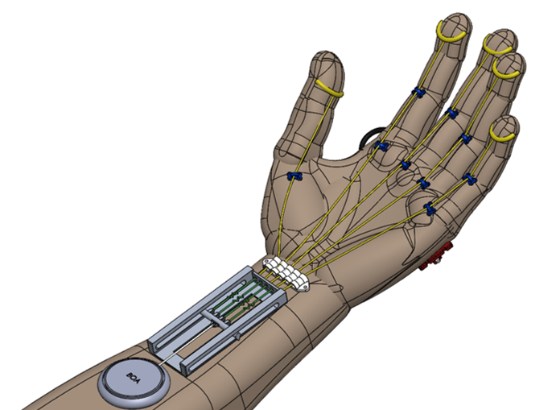

  <i>Final CAD model of the assistive glove</i>

The assistive glove is comprised of fingercaps, connectors, stainless steel cables, a wrist connector, a cable management system, elastic clamps, elastic bands, and a BOA closure system. To operate the glove, users turn the Boa system with their non-paretic hand which tensions the cables running through the cable management system, wrist connector and connectors on the hand. As the Boa system is turned, and cables are tensioned, the hand will close and then grip when fingers encounter an object. The cable management system, prevents the user from accidentally over-gripping an object due to the elastics in this system protecting the user through their natural give. Once the user no longer wants to grip an object they release the Boa system and the elastic placed on the back of the glove gently returns the fingers of the paretic hand to a neutral position.

  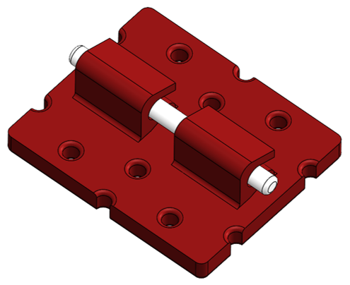
  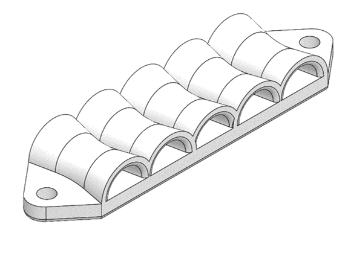
  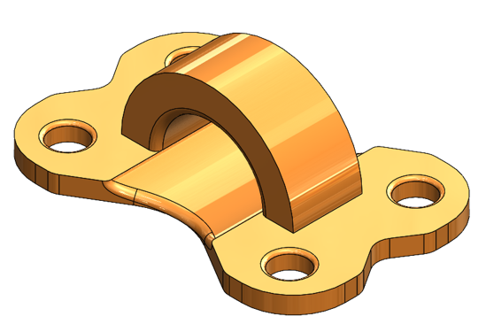
  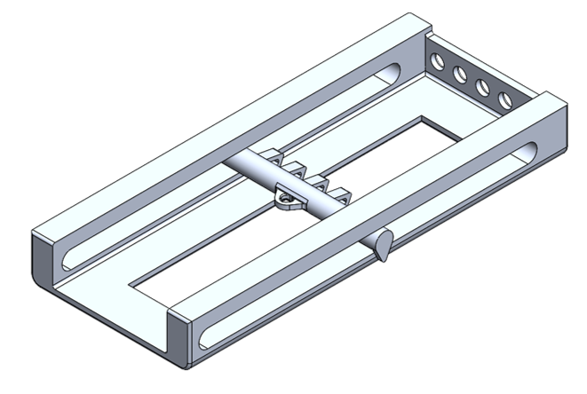

  <i>From left to right: elastic clamp, wrist connector, connector, cable management system</i>

I was directly responsible for all CAD created during this project, research regarding exoskeletons for storke patients and grip statistics post physical therapy, presenting to our advisor each week, writing and editing parts of our paper, and editing our expo video.

Here are links to view our [final paper](https://drive.google.com/file/d/1mqHW07AHK_YpyxvJ7bdfSUrxTqC2Y5-0/view?usp=sharing), [poster](Capstone_project_poster-1.jpg), and [video](https://youtu.be/u68bepYqKqc).

## Undergraduate Reasearch Assistant, Rapid Operator Awareness with Mobile Robotics (ROAMR)

