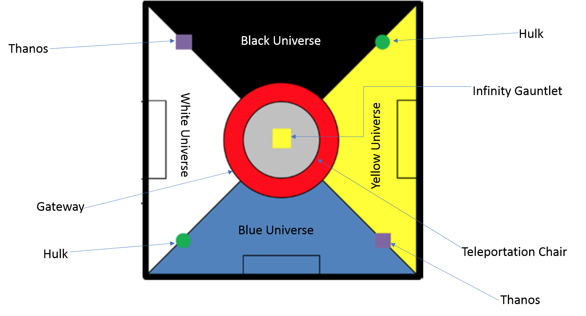
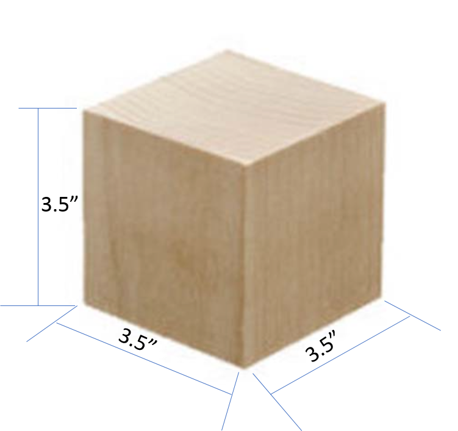
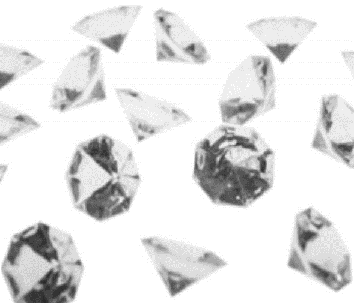
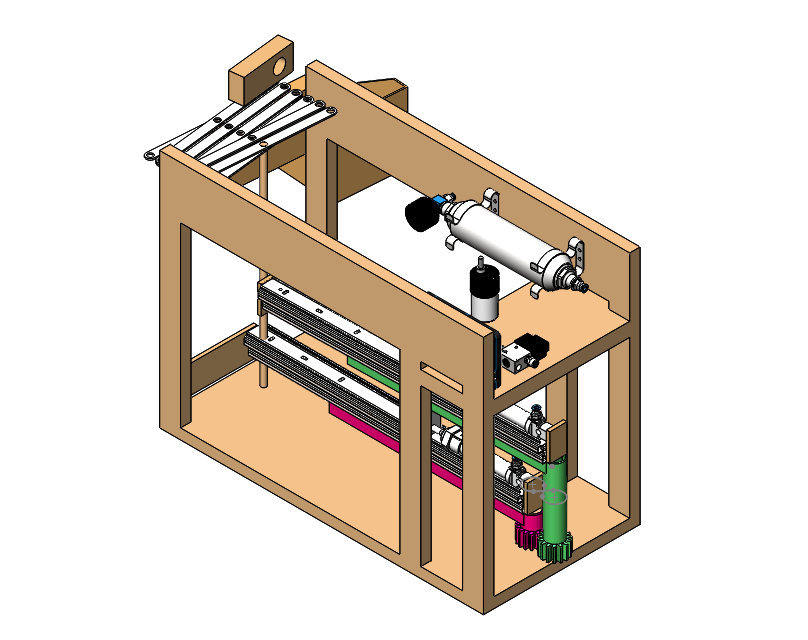
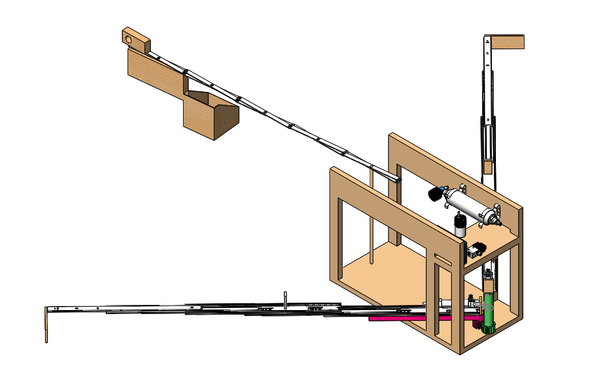
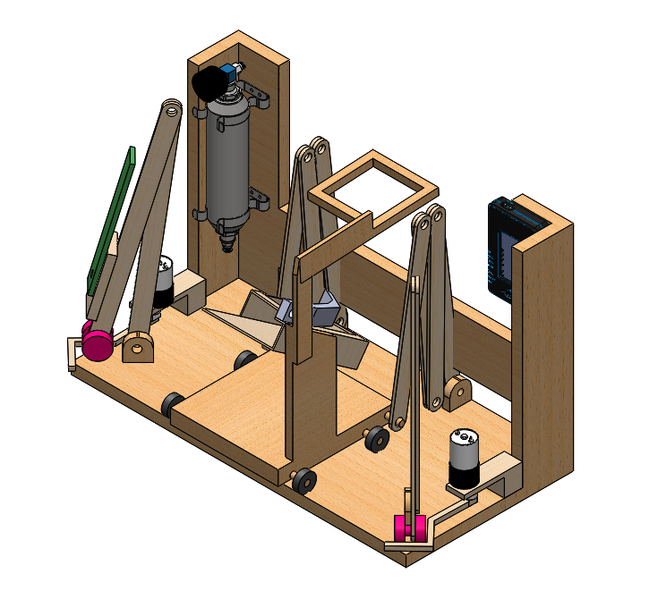
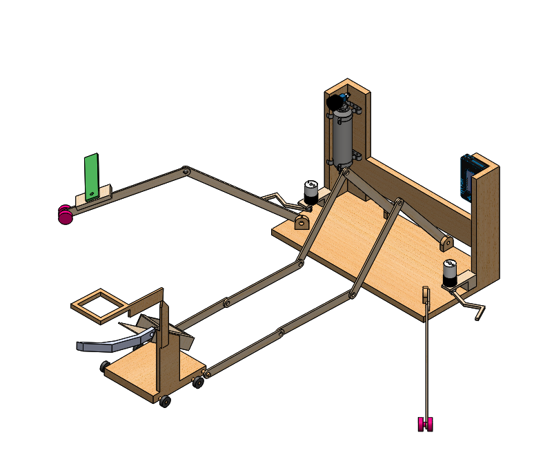
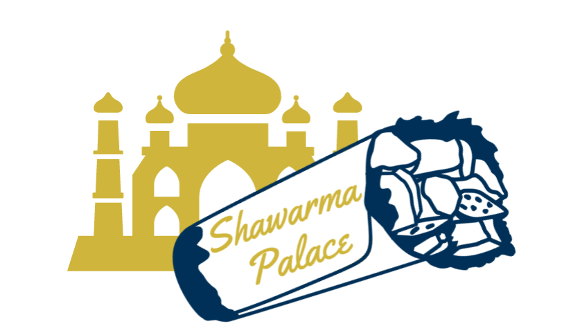

  

  Benjamin Mangel, Georgia Institute of Technology December 2020  

  B.S. Mechanical Engineering, Minor in Computer Science - Computing & Intelligence Thread

## Porfolio Guide
This guide will be split into specific projects, in chronological order. Alternatively, each one can be accessed by clicking it's subsequent link below.

#### Links:
- [ME 2110 Competition Project](#2110)
- [CS 4641 Group Project](#4641)
- [ME 4182 Capstone](#4182)
- [Undergraduate Research](#undrgrd)

## ME 2110, Creative Decisions and Designs: Competition Project
In this class students learned different approaches to ideation and were exposed to the engineering process throughout the entire semester. The class revolved around creating a robot for the class competition at the end of the semester. In the compettion, each team competes in two rounds and those with strong scores in those rounds continue in the competition. After the qualifying rounds the competition runs similarly to a tournament with over 50 teams at the start, in qualifying, and 32 in the first elimination round. Each semester has a theme, ours was Infinity Wars. Our team "Schawarma Palace" came second in design review and our robot "Black Widow" came in 10th place in the competition, making the quarterfinals.

The goal of the competition was to score the most points, head-to-head, against three other teams. The main ways to score points in the competition were saving the "Hulk" object, pushing away the "Thanos" object, recovering "infinity stones", and grabbing the "infinty gauntlet".

  
  
  
  
  

  <i>From left to right: Competition Track, Hulk, Thanos, Infinity Stones, Infinity Gauntlet</i>

Our robot's design differed compared to the majority of robot designs. While most teams situated their robot with one of the short end facing the center of the competition zone, we placed "Black Widow" with one of the long end facing the center, allowing us to use a cart to collect gems instead of a sliding arm.

  
  

  <i>Majority of robot designs share similarities with this design we created during our ideation process, primarily the sliding arm to collect gems</i>

  
  

  <i>Final design of Black Widow, major differences are orientation of robot and rolling cart for gem collection</i>

During this project, I was tasked with creating our team logo and some of the CAD, machining and assembling the robot, writing the Labview coding loop for the NI MyRIO, and writing parts of our report.

  

  <i>Logo created using CustomInk interface</i>

If you're interested in learning more about the competition and our design process here is our [final video](https://www.youtube.com/watch?v=8frTduJzepY).

## CS 4641, Intro to Machine Learning: Group Project

## ME 4182, Capstone

## Undergraduate Reasearch Assistant, Rapid Operator Awareness with Mobile Robotics (ROAMR)
